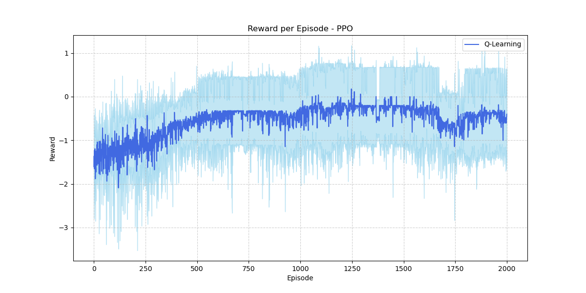

# RL\_Experiment

A reinforcement learning project exploring different RL algorithms on a custom-built grid-world environment (**BoxEnv**).

Currently implemented: **Q-Learning**, **DQN**, and **PPO**. We also extend DQN with **Monte Carlo Tree Search (MCTS)** for planning-enhanced decision making.

---

## Project Overview


The **BoxEnv** environment is a grid-world style task where an agent must navigate through walls and obstacles to reach the goal. The sparse reward structure makes it a challenging environment for standard RL algorithms.

---

## Project Structure

```
.
├── box_env/              # Custom environment and wrappers
├── config/               # Algorithm hyperparameter YAML files
├── models/               # Implementations of Q-Learning, DQN, PPO
├── scripts/              # Training & evaluation scripts
├── results/              # Checkpoints, CSV logs, plots
├── utils/                # Helper functions, plotting, save/load utilities
├── main.py               # CLI entrypoint for training
└── pyproject.toml        # Project metadata
```

---

## Installation

1. Clone the repository:

```bash
git clone https://github.com/Manohara-Ai/RL_Experiment.git
cd RL_Experiment
```

2. Install dependencies:

```bash
pip install -e .
```

---

## Running Experiments

Use the `main.py` entrypoint to run training with the algorithm of your choice:

### Run Q-Learning

```bash
python3 main.py --algo qlearning
```

### Run DQN

```bash
python3 main.py --algo dqn
```

### Run PPO

```bash
python3 main.py --algo ppo
```

This will:

* Load hyperparameters from the corresponding YAML config in `config/`
* Initialize the **BoxEnv** environment
* Train the chosen agent
* Save results in `results/` (checkpoints, logs, and plots)

---

## Results

All training logs and evaluation metrics are saved under `results/`. Here we present the key findings from our experiments.

### **Q-Learning**


The **Q-Learning agent** shows limited learning capability. Its average reward fluctuates around a negative value throughout training and fails to converge toward a consistent optimal policy. This stagnation is expected given the large state space of `BoxEnv`—tabular Q-learning cannot effectively explore or generalize in this environment. The agent frequently gets stuck in loops, colliding with walls or obstacles, which results in persistently negative rewards.

### **DQN**


The **DQN agent** demonstrates clearer learning progress. Starting from negative rewards, its performance steadily improves as training progresses. By leveraging a deep neural network with experience replay, DQN successfully generalizes across unseen states and avoids the pitfalls of tabular Q-learning. The reward curve becomes smoother and trends upward, though evaluation results reveal that it still struggles to consistently solve the environment.

### **PPO**



The **PPO agent** performs poorly in this environment. Its reward curve consistently decreases, reflecting the difficulty of sparse reward tasks for on-policy algorithms. PPO fails to gather enough positive experiences to update its policy effectively. Unlike DQN, PPO cannot rely on off-policy replay, which further limits its ability to bootstrap from rare successful trajectories.

### **DQN + MCTS**


The plot above shows the **cumulative rewards across 50 evaluation games** for both the standalone **DQN agent** and the hybrid **DQN+MCTS agent**.


* The **DQN curve** stays consistently below zero, reflecting its difficulty in achieving reliable success during evaluation. Despite having improved during training, the agent frequently stalls or terminates by reaching the 75-step cap, leading to a negative overall score.
* By contrast, the **DQN+MCTS curve** trends upward and stabilizes above zero. This demonstrates the effect of planning: the agent is able to explore ahead, avoid dead ends, and achieve better long-term outcomes even in challenging scenarios.


**Evaluation Statistics (50 games):**


* **DQN:** Average Reward = **-2.062**, Average Inference Time = **0.0002s per step**
* **DQN+MCTS:** Average Reward = **0.050**, Average Inference Time = **0.0133s per step**


The comparison highlights a clear **trade-off between speed and robustness**:


* **DQN Strategy** – Fast and reactive, but prone to failure. About 76% of its games end by hitting the maximum step limit.
* **DQN+MCTS Strategy** – Slower due to the planning overhead, yet more effective. It reaches the 75-step cap in ~90% of games, reflecting persistence in exploring solutions, and ultimately achieves higher rewards.


In summary, the line plot and statistics together confirm that **DQN+MCTS outperforms DQN** in terms of reliability and reward, albeit at the cost of slower inference.

---

## Future Work

* Extend planning-enhanced methods (TreeQN).

---

## License

This project is licensed under the [LICENSE](LICENSE) file.
