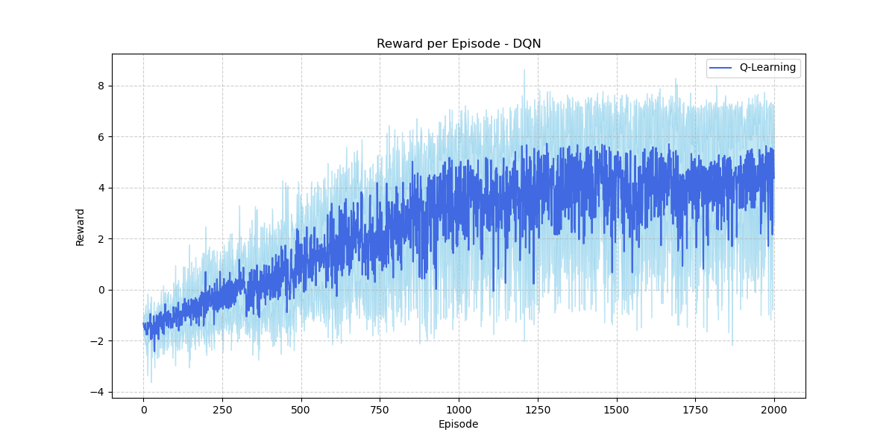

# RL\_Experiment

A reinforcement learning project exploring different RL algorithms on a custom-built grid-world environment (**BoxEnv**).

Currently implemented: **Q-Learning**, **DQN**, and **PPO**. We also extend DQN with **Monte Carlo Tree Search (MCTS)** for planning-enhanced decision making.

---

## Project Overview


The **BoxEnv** environment is a grid-world style task where an agent must navigate through walls and obstacles to reach the goal. The sparse reward structure makes it a challenging environment for standard RL algorithms.

---

## Project Structure

```
.
├── box_env/              # Custom environment and wrappers
├── config/               # Algorithm hyperparameter YAML files
├── models/               # Implementations of Q-Learning, DQN, PPO
├── scripts/              # Training & evaluation scripts
├── results/              # Checkpoints, CSV logs, plots
├── utils/                # Helper functions, plotting, save/load utilities
├── main.py               # CLI entrypoint for training
└── pyproject.toml        # Project metadata
```

---

## Installation

1. Clone the repository:

```bash
git clone https://github.com/Manohara-Ai/RL_Experiment.git
cd RL_Experiment
```

2. Install dependencies:

```bash
pip install -e .
```

---

## Running Experiments

Use the `main.py` entrypoint to run training with the algorithm of your choice:

### Run Q-Learning

```bash
python3 main.py --algo qlearning
```

### Run DQN

```bash
python3 main.py --algo dqn
```

### Run PPO

```bash
python3 main.py --algo ppo
```

This will:

* Load hyperparameters from the corresponding YAML config in `config/`
* Initialize the **BoxEnv** environment
* Train the chosen agent
* Save results in `results/` (checkpoints, logs, and plots)

---

## Results

All training logs and evaluation metrics are saved under `results/`. Here we present the key findings from our experiments.

### **Q-Learning**


The **Q-Learning agent** shows limited learning capability. Its average reward fluctuates around a negative value throughout training and fails to converge toward a consistent optimal policy. This stagnation is expected given the large state space of `BoxEnv`—tabular Q-learning cannot effectively explore or generalize in this environment. The agent frequently gets stuck in loops, colliding with walls or obstacles, which results in persistently negative rewards.

### **DQN**



The **DQN agent** demonstrates clearer learning progress. Starting from negative rewards, its performance steadily improves as training progresses. By leveraging a deep neural network with experience replay, DQN successfully generalizes across unseen states and avoids the pitfalls of tabular Q-learning. The reward curve becomes smoother and trends upward, though evaluation results reveal that it still struggles to consistently solve the environment.

**Evaluation Statistics (50 games):**

* Average Reward: **-2.062**
* Average Inference Time: **0.0002 seconds**

The negative evaluation reward indicates that while DQN improves during training, it is not reliably successful at test time.

### **PPO**


The **PPO agent** performs poorly in this environment. Its reward curve consistently decreases, reflecting the difficulty of sparse reward tasks for on-policy algorithms. PPO fails to gather enough positive experiences to update its policy effectively. Unlike DQN, PPO cannot rely on off-policy replay, which further limits its ability to bootstrap from rare successful trajectories.

### **DQN + MCTS**


To address DQN’s weaknesses, we integrated **Monte Carlo Tree Search (MCTS)** as a planning module on top of the learned DQN policy. The hybrid **DQN+MCTS** agent achieved significantly better performance:

**Evaluation Statistics (50 games):**

* Average Reward: **0.050** (positive, in contrast to DQN’s negative score)
* Average Inference Time: **0.0133 seconds**

This demonstrates a clear **trade-off between speed and success**:

* **DQN Strategy:** Fast and reactive (0.0002s per step). However, it is prone to failure—76% of its games ended by hitting the maximum step limit (75).
* **DQN+MCTS Strategy:** Slower due to planning (0.0133s per step), but more robust. The agent explores ahead, often finding viable paths to the goal. 90% of its games reached the 75-step cap, reflecting its willingness to extend episodes in search of solutions.

In summary:

* **DQN** learns faster but fails more often during evaluation.
* **DQN+MCTS** sacrifices speed for robustness, achieving consistently higher rewards.

---

## Future Work

* Improve reward shaping to mitigate the sparse reward problem.
* Extend planning-enhanced methods (TreeQN, MCTS-guided PPO).
* Experiment with curriculum learning to help PPO adapt.
* Benchmark against additional algorithms (A3C, SAC).

---

## License

This project is licensed under the [LICENSE](LICENSE) file.
